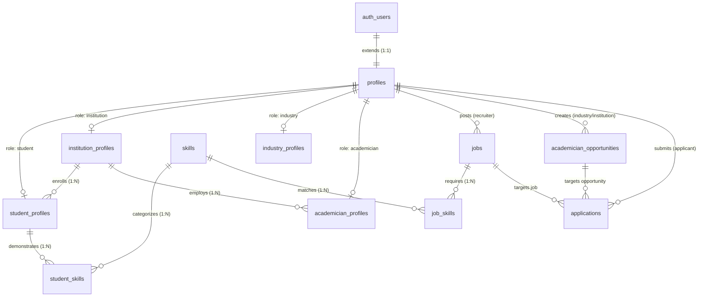

# Database Architecture & Security Specification

**Project**: Academia-Industry Collaboration Portal  
**Platform**: PostgreSQL 15+ / Supabase  
**Phase**: 1 — Database Architecture, Relational Schema & Zero-Trust RLS Layer  

---

## 1. Executive Summary & Architecture Overview

The **Academia-Industry Collaboration Portal** database is architected on a normalized PostgreSQL relational foundation, hardened with zero-trust **Row Level Security (RLS)**. It seamlessly bridges four critical stakeholders:

1. **Students**: Track verified skill competencies, benchmark skill gaps, complete assessments, and apply to curated jobs/internships.
2. **Industry Recruiters**: Publish opportunities, establish mandatory/optional skill cutoffs, and evaluate candidates via algorithmic skill match scoring.
3. **Academicians & Faculty**: Access Faculty Development Programs (FDPs), industry consulting problems, research grants, and joint labs.
4. **Institutions / Colleges**: Manage student credential verification, monitor batch placement readiness analytics, and track institutional performance.

---

## 2. Entity-Relationship Data Dictionary

### 2.1 `profiles` (Master User Extension)
Extends Supabase `auth.users` with Role-Based Access Control (RBAC) metadata and baseline identity attributes.

| Column | Type | Constraints | Description |
| :--- | :--- | :--- | :--- |
| `id` | `UUID` | `PK`, `REFERENCES auth.users(id) ON DELETE CASCADE` | Unique user identifier synced with Supabase Auth |
| `role` | `user_role` | `NOT NULL`, `ENUM('student', 'industry', 'academician', 'institution')` | Stakeholder platform role |
| `full_name` | `TEXT` | `NOT NULL` | Full display name / Legal entity name |
| `email` | `TEXT` | `NOT NULL` | Primary email address |
| `avatar_url` | `TEXT` | `NULL` | Public CDN profile avatar URL |
| `phone` | `TEXT` | `NULL` | Contact phone number |
| `bio` | `TEXT` | `NULL` | Short biography or organization summary |
| `created_at` | `TIMESTAMPTZ` | `DEFAULT now()`, `NOT NULL` | Account registration timestamp |
| `updated_at` | `TIMESTAMPTZ` | `DEFAULT now()`, `NOT NULL` | Last profile modification timestamp |

---

### 2.2 `institution_profiles` (Colleges & Universities)
Maintains directory information, NIRF/NAAC accreditation credentials, and institutional verification flags.

| Column | Type | Constraints | Description |
| :--- | :--- | :--- | :--- |
| `id` | `UUID` | `PK`, `REFERENCES profiles(id) ON DELETE CASCADE` | Institution identity identifier |
| `institution_name` | `TEXT` | `NOT NULL` | Registered name of College/University |
| `aishe_code` | `TEXT` | `UNIQUE`, `NULL` | All India Survey on Higher Education (AISHE) identifier |
| `accreditation_grade`| `TEXT` | `NULL` | e.g. "NAAC A++", "NBA Accredited Tier-1", "NIRF Top 50" |
| `state` | `TEXT` | `NOT NULL` | State jurisdiction |
| `city` | `TEXT` | `NOT NULL` | Campus city location |
| `website` | `TEXT` | `NULL` | Official institutional web URL |
| `is_verified_institution` | `BOOLEAN` | `DEFAULT false`, `NOT NULL` | AICTE / MoE verification status flag |
| `created_at` | `TIMESTAMPTZ` | `DEFAULT now()`, `NOT NULL` | Registration timestamp |
| `updated_at` | `TIMESTAMPTZ` | `DEFAULT now()`, `NOT NULL` | Record update timestamp |

---

### 2.3 `industry_profiles` (Corporates & Recruiters)
Stores corporate credentials, industry vertical classifications, and statutory registration numbers.

| Column | Type | Constraints | Description |
| :--- | :--- | :--- | :--- |
| `id` | `UUID` | `PK`, `REFERENCES profiles(id) ON DELETE CASCADE` | Recruiter/Corporate user identifier |
| `company_name` | `TEXT` | `NOT NULL` | Registered enterprise name |
| `industry_sector` | `TEXT` | `NOT NULL` | Domain (e.g. IT, FinTech, Automotive, Semi-conductors) |
| `cin_or_gstin` | `TEXT` | `NULL` | Statutory corporate identification / GST number |
| `company_size` | `TEXT` | `NULL` | Team size (e.g. '1-50', '51-500', '1000+') |
| `website` | `TEXT` | `NULL` | Corporate website URL |
| `is_verified_company`| `BOOLEAN` | `DEFAULT false`, `NOT NULL` | Corporate verification badge status |
| `created_at` | `TIMESTAMPTZ` | `DEFAULT now()`, `NOT NULL` | Registration timestamp |
| `updated_at` | `TIMESTAMPTZ` | `DEFAULT now()`, `NOT NULL` | Record update timestamp |

---

### 2.4 `academician_profiles` (Faculty & Mentors)
Captures faculty departmental affiliation, research specializations, and publication credentials.

| Column | Type | Constraints | Description |
| :--- | :--- | :--- | :--- |
| `id` | `UUID` | `PK`, `REFERENCES profiles(id) ON DELETE CASCADE` | Academician user identifier |
| `institution_id` | `UUID` | `REFERENCES institution_profiles(id) ON DELETE SET NULL` | Parent college / institute linkage |
| `department` | `TEXT` | `NOT NULL` | Academic department (e.g. 'Computer Science') |
| `designation` | `TEXT` | `NOT NULL` | e.g. 'Associate Professor', 'Dean R&D' |
| `highest_qualification`| `TEXT` | `NULL` | e.g. 'Ph.D in Machine Learning' |
| `orcid_id` | `TEXT` | `NULL` | Open Researcher and Contributor ID |
| `research_areas` | `TEXT[]` | `NULL` | Array of research domains / keyword tags |
| `created_at` | `TIMESTAMPTZ` | `DEFAULT now()`, `NOT NULL` | Registration timestamp |
| `updated_at` | `TIMESTAMPTZ` | `DEFAULT now()`, `NOT NULL` | Record update timestamp |

---

### 2.5 `student_profiles` (Student Academic Records)
Maintains student degree progress, institutional enrollment, and verified status.

| Column | Type | Constraints | Description |
| :--- | :--- | :--- | :--- |
| `id` | `UUID` | `PK`, `REFERENCES profiles(id) ON DELETE CASCADE` | Student user identifier |
| `institution_id` | `UUID` | `REFERENCES institution_profiles(id) ON DELETE SET NULL` | Linked enrolled college |
| `roll_number` | `TEXT` | `NULL` | University enrollment / roll number |
| `department` | `TEXT` | `NOT NULL` | Degree branch (e.g. 'Computer Engineering') |
| `degree` | `TEXT` | `NOT NULL` | Academic program (e.g. 'B.Tech', 'M.Tech', 'MCA') |
| `graduation_year` | `INTEGER` | `NOT NULL` | Expected year of graduation |
| `cgpa` | `NUMERIC(4, 2)`| `CHECK (cgpa >= 0.00 AND cgpa <= 10.00)` | Cumulative Grade Point Average |
| `verified_status`| `verification_status` | `DEFAULT 'unverified'`, `NOT NULL` | Status: `unverified`, `pending`, `verified`, `rejected` |
| `verified_at` | `TIMESTAMPTZ` | `NULL` | Timestamp of institutional verification |
| `verified_by` | `UUID` | `REFERENCES profiles(id) ON DELETE SET NULL` | College authority user ID who signed off |
| `summary` | `TEXT` | `NULL` | Personal career objective & bio |
| `resume_url` | `TEXT` | `NULL` | Secure cloud storage URL to PDF resume |
| `github_url` | `TEXT` | `NULL` | GitHub profile URL |
| `linkedin_url` | `TEXT` | `NULL` | LinkedIn profile URL |
| `portfolio_url` | `TEXT` | `NULL` | Personal portfolio / live project link |
| `created_at` | `TIMESTAMPTZ` | `DEFAULT now()`, `NOT NULL` | Timestamp created |
| `updated_at` | `TIMESTAMPTZ` | `DEFAULT now()`, `NOT NULL` | Timestamp updated |

---

### 2.6 `skills` (Master Skill Taxonomy)
Curated catalog of standardized technical and non-technical proficiencies.

| Column | Type | Constraints | Description |
| :--- | :--- | :--- | :--- |
| `id` | `UUID` | `PK`, `DEFAULT gen_random_uuid()` | Skill identifier |
| `name` | `TEXT` | `UNIQUE`, `NOT NULL` | Canonical skill name (e.g. 'React', 'Rust') |
| `category` | `skill_category_enum` | `NOT NULL` | `programming_languages`, `frameworks_libraries`, `databases`, `cloud_devops`, `ai_ml_datascience`, `cybersecurity`, `core_engineering`, `soft_skills` |
| `description` | `TEXT` | `NULL` | Industry definition and domain scope |
| `created_at` | `TIMESTAMPTZ` | `DEFAULT now()`, `NOT NULL` | Record creation timestamp |

---

### 2.7 `student_skills` (Competency & Assessment Registry)
Links students to skills with quantitative proficiency metrics (0–100) and institutional/assessment verification lineage.

| Column | Type | Constraints | Description |
| :--- | :--- | :--- | :--- |
| `id` | `UUID` | `PK`, `DEFAULT gen_random_uuid()` | Junction record identifier |
| `student_id` | `UUID` | `REFERENCES student_profiles(id) ON DELETE CASCADE` | Student reference |
| `skill_id` | `UUID` | `REFERENCES skills(id) ON DELETE CASCADE` | Master skill reference |
| `proficiency_score`| `INTEGER` | `NOT NULL`, `CHECK (score >= 0 AND score <= 100)` | Standardized competency index |
| `is_verified` | `BOOLEAN` | `DEFAULT false`, `NOT NULL` | Verified assessment badge flag |
| `verified_by` | `UUID` | `REFERENCES profiles(id) ON DELETE SET NULL` | Verifying authority or Proctor ID |
| `verification_source`| `TEXT`| `DEFAULT 'self_reported'`, `NOT NULL` | e.g. `'assessment'`, `'hackathon_credential'`, `'faculty_endorsement'` |
| `last_assessed_at`| `TIMESTAMPTZ`| `NULL` | Timestamp of latest evaluation |
| `created_at` | `TIMESTAMPTZ` | `DEFAULT now()`, `NOT NULL` | Skill claimed timestamp |
| `updated_at` | `TIMESTAMPTZ` | `DEFAULT now()`, `NOT NULL` | Score update timestamp |
| *Constraint* | `UNIQUE` | `(student_id, skill_id)` | Prevents duplicate skill mappings |

---

### 2.8 `jobs` (Industry Postings)
Structured job and internship listings posted by authenticated corporate recruiters.

| Column | Type | Constraints | Description |
| :--- | :--- | :--- | :--- |
| `id` | `UUID` | `PK`, `DEFAULT gen_random_uuid()` | Unique job identifier |
| `recruiter_id` | `UUID` | `REFERENCES profiles(id) ON DELETE CASCADE` | Recruiter profile who authored posting |
| `company_name` | `TEXT` | `NULL` | Hiring enterprise name |
| `title` | `TEXT` | `NOT NULL` | Job headline (e.g. 'Full Stack React Engineer') |
| `description` | `TEXT` | `NOT NULL` | Role requirements, expectations, and perks |
| `job_type` | `job_type_enum` | `NOT NULL` | `internship`, `full_time`, `part_time`, `contract` |
| `workplace_type` | `workplace_type_enum` | `DEFAULT 'hybrid'`, `NOT NULL` | `remote`, `on_site`, `hybrid` |
| `location` | `TEXT` | `NULL` | City/State/Country |
| `stipend_min` | `NUMERIC(12,2)` | `NULL` | Minimum salary / stipend figure |
| `stipend_max` | `NUMERIC(12,2)` | `NULL` | Maximum salary / stipend figure |
| `currency` | `VARCHAR(5)` | `DEFAULT 'INR'`, `NOT NULL` | Currency symbol |
| `stipend_range` | `TEXT` | `GENERATED ALWAYS AS STORED` | Auto-formatted display string (e.g. "25000 - 45000 INR") |
| `experience_level`| `TEXT` | `NULL` | e.g. 'Fresher (0-1 yrs)', 'Mid-level' |
| `status` | `job_status_enum`| `DEFAULT 'active'`, `NOT NULL` | `draft`, `active`, `paused`, `closed`, `archived` |
| `deadline` | `TIMESTAMPTZ` | `NULL` | Application cutoff date |
| `created_at` | `TIMESTAMPTZ` | `DEFAULT now()`, `NOT NULL` | Creation timestamp |
| `updated_at` | `TIMESTAMPTZ` | `DEFAULT now()`, `NOT NULL` | Last edit timestamp |

---

### 2.9 `job_skills` (Skill Benchmarks)
Specifies mandatory versus optional skill prerequisites and minimum cut-off proficiency thresholds.

| Column | Type | Constraints | Description |
| :--- | :--- | :--- | :--- |
| `id` | `UUID` | `PK`, `DEFAULT gen_random_uuid()` | Criterion identifier |
| `job_id` | `UUID` | `REFERENCES jobs(id) ON DELETE CASCADE` | Target job posting |
| `skill_id` | `UUID` | `REFERENCES skills(id) ON DELETE CASCADE` | Required master skill |
| `is_mandatory` | `BOOLEAN` | `DEFAULT true`, `NOT NULL` | Mandatory requirement flag |
| `min_proficiency_score`| `INTEGER` | `DEFAULT 50`, `CHECK (score BETWEEN 0 AND 100)` | Minimum cut-off competency score |
| `created_at` | `TIMESTAMPTZ` | `DEFAULT now()`, `NOT NULL` | Timestamp |
| *Constraint* | `UNIQUE` | `(job_id, skill_id)` | Single entry per skill per job |

---

### 2.10 `academician_opportunities` (FDPs, Grants & Consultancies)
Facilitates corporate problems, Faculty Development Programs, and academic-industry research contracts.

| Column | Type | Constraints | Description |
| :--- | :--- | :--- | :--- |
| `id` | `UUID` | `PK`, `DEFAULT gen_random_uuid()` | Opportunity identifier |
| `creator_id` | `UUID` | `REFERENCES profiles(id) ON DELETE CASCADE` | Industry recruiter or Institution admin ID |
| `opportunity_type`| `opportunity_type_enum`| `NOT NULL` | `fdp`, `research_grant`, `consultancy`, `curriculum_review`, `guest_lecture`, `joint_lab` |
| `title` | `TEXT` | `NOT NULL` | Opportunity title |
| `description` | `TEXT` | `NOT NULL` | Scope of work, deliverables, eligibility |
| `organization_name`| `TEXT` | `NOT NULL` | Sponsoring company or institution |
| `budget_or_grant`| `NUMERIC(12,2)` | `NULL` | Financial honorarium or grant funding |
| `currency` | `VARCHAR(5)` | `DEFAULT 'INR'`, `NOT NULL` | Currency |
| `duration` | `TEXT` | `NULL` | e.g. "4 Weeks", "6 Months" |
| `status` | `opportunity_status_enum`| `DEFAULT 'open'`, `NOT NULL` | `open`, `in_progress`, `closed`, `archived` |
| `deadline` | `TIMESTAMPTZ` | `NULL` | Proposal submission cutoff date |
| `created_at` | `TIMESTAMPTZ` | `DEFAULT now()`, `NOT NULL` | Created at |
| `updated_at` | `TIMESTAMPTZ` | `DEFAULT now()`, `NOT NULL` | Updated at |

---

### 2.11 `applications` (Unified Pipeline)
Multi-role application engine routing students to jobs and faculty to research/FDP opportunities.

| Column | Type | Constraints | Description |
| :--- | :--- | :--- | :--- |
| `id` | `UUID` | `PK`, `DEFAULT gen_random_uuid()` | Unique application tracking ID |
| `applicant_id` | `UUID` | `REFERENCES profiles(id) ON DELETE CASCADE` | Student or Faculty applicant ID |
| `job_id` | `UUID` | `REFERENCES jobs(id) ON DELETE CASCADE`, `NULL` | Targeted job (mutually exclusive with opportunity) |
| `academician_opportunity_id`| `UUID`| `REFERENCES academician_opportunities(id) ON DELETE CASCADE`, `NULL` | Targeted opportunity |
| `status` | `application_status_enum`| `DEFAULT 'applied'`, `NOT NULL` | `applied`, `under_review`, `shortlisted`, `interviewing`, `accepted`, `rejected`, `withdrawn` |
| `cover_note` | `TEXT` | `NULL` | Statement of purpose / Pitch |
| `resume_snapshot_url`| `TEXT` | `NULL` | Snapshot of resume at time of application |
| `calculated_match_score`| `NUMERIC(5,2)`| `CHECK (score BETWEEN 0 AND 100)` | Cached automated match score percentage |
| `created_at` | `TIMESTAMPTZ` | `DEFAULT now()`, `NOT NULL` | Application submission time |
| `updated_at` | `TIMESTAMPTZ` | `DEFAULT now()`, `NOT NULL` | Status update time |
| *Check Constraint*| `check_single_application_target` | Ensures exactly one of `job_id` or `academician_opportunity_id` is populated |
| *Unique Constraints*| `UNIQUE(applicant_id, job_id)`, `UNIQUE(applicant_id, academician_opportunity_id)` | Prevents duplicate applications |

---

## 3. Row Level Security (RLS) Policy Matrix

All 11 tables have PostgreSQL **Row Level Security (RLS)** strictly enabled (`ALTER TABLE ... ENABLE ROW LEVEL SECURITY;`).

| Table | Operation | Target Role | Permissive Rule / `USING` Expression |
| :--- | :--- | :--- | :--- |
| **`profiles`** | `SELECT` | `authenticated` | `true` (Public directory for authenticated members) |
| | `INSERT` | `authenticated` | `auth.uid() = id` |
| | `UPDATE` | `authenticated` | `auth.uid() = id` (User can only edit own record) |
| **`student_profiles`** | `SELECT` | `authenticated` | `auth.uid() = id` (Self)   OR `institution_id = auth.uid()` (College)   OR (`get_current_user_role() = 'industry'` AND `verified_status = 'verified'`)   OR `get_current_user_role() IN ('academician', 'institution')` |
| | `INSERT` | `authenticated` | `auth.uid() = id AND get_current_user_role() = 'student'` |
| | `UPDATE` | `authenticated` | `auth.uid() = id` (Student) OR `institution_id = auth.uid()` (Institution verifying credentials) |
| **`student_skills`** | `SELECT` | `authenticated` | `student_id = auth.uid()` OR `is_institution_for_student(student_id)` OR `get_current_user_role() IN ('industry', 'academician')` |
| | `INSERT` | `authenticated` | `student_id = auth.uid()` |
| | `UPDATE` | `authenticated` | `student_id = auth.uid()` OR `is_institution_for_student(student_id)` |
| | `DELETE` | `authenticated` | `student_id = auth.uid()` |
| **`jobs`** | `SELECT` | `authenticated` | `status = 'active' OR recruiter_id = auth.uid()` |
| | `INSERT` | `authenticated` | `recruiter_id = auth.uid() AND get_current_user_role() = 'industry'` |
| | `UPDATE` / `DELETE`| `authenticated` | `recruiter_id = auth.uid()` |
| **`job_skills`** | `SELECT` | `authenticated` | `true` |
| | `ALL` | `authenticated` | `is_job_owner(job_id)` (Recruiter who owns the job) |
| **`academician_opportunities`**| `SELECT` | `authenticated` | `status = 'open' OR creator_id = auth.uid()` |
| | `INSERT` | `authenticated` | `creator_id = auth.uid() AND get_current_user_role() IN ('industry', 'institution')` |
| | `UPDATE` / `DELETE`| `authenticated` | `creator_id = auth.uid()` |
| **`applications`** | `SELECT` | `authenticated` | `applicant_id = auth.uid()` (Applicant)   OR `is_job_owner(job_id)` (Recruiter)   OR `is_opportunity_owner(opp_id)` (Creator)   OR `is_institution_for_student(applicant_id)` (College placement cell) |
| | `INSERT` | `authenticated` | `applicant_id = auth.uid()` |
| | `UPDATE` | `authenticated` | `applicant_id = auth.uid()` OR `is_job_owner(job_id)` OR `is_opportunity_owner(opp_id)` |
| | `DELETE` | `authenticated` | `applicant_id = auth.uid()` (Withdrawal) |

---

## 4. Algorithmic Match Scoring Stored Procedure

The database includes an autonomous server-side PL/pgSQL function `calculate_job_match_score(p_student_id UUID, p_job_id UUID)` that computes a weighted match score between student competencies and job prerequisites:

$$\text{Final Match Score} = \left( \frac{\sum \text{Score}_{\text{Mandatory}}}{N_{\text{Mandatory}}} \times 70\% + \frac{\sum \text{Score}_{\text{Optional}}}{N_{\text{Optional}}} \times 30\% \right) \times 100$$

Where per-skill achievement is calculated as:
$$\text{Skill Achievement} = \min\left(1.0, \frac{\text{Student Proficiency}}{\max(1, \text{Required Cutoff})}\right)$$

This executes in sub-millisecond database runtime, removing compute overhead from the client.
